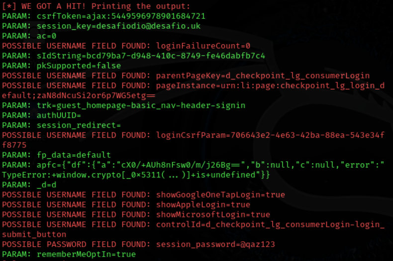

# Phishing para captura de senhas do Linkedin
Tarefa de desafio phishing, devido a mudanças na estrutura do Facebook, realizei a atividade tendo como alvo o site do Linkedin.

### Ferramentas

- Kali Linux
- setoolkit

### Configurando o Phishing no Kali Linux

- Acesso root: ``` sudo su ```
- Iniciando o setoolkit: ``` setoolkit ```
- Tipo de ataque: ``` Social-Engineering Attacks ```
- Vetor de ataque: ``` Web Site Attack Vectors ```
- Método de ataque: ```Credential Harvester Attack Method ```
- Método de ataque: ``` Site Cloner ```
- Obtendo o endereço da máquina: ``` ifconfig ```
- URL para clone: http://www.linkedin.com/login/pt?fromSignIn=true&trk=guest_homepage-basic_nav-header-signin

### Resutados


